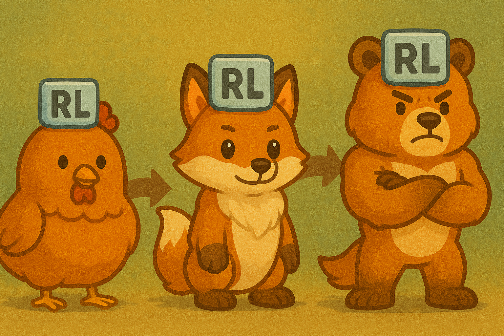

# Awesome RL for AI Agents 

  

> A curated list of recent progress and resources on Reinforcement Learning for AI Agents.  

## 🔎 Quick Navigation 

* [Agentic Workflow without Training](#agentic-workflow-without-training)
* [Agent Evaluation and Benchmarks](#agent-evaluation-and-benchmarks)
* [Agent Training Frameworks](#agent-training-frameworks)
* [RL for Single Agent](#rl-for-single-agent)

  * [Self-Evolution & Test-Time RL](#self-evolution--test-time-rl)
  * [RL for Tool Use & Agent Training](#rl-for-tool-use--agent-training)
  * [Memory & Knowledge Management](#memory--knowledge-management)
  * [Fine-Grained RL & Trajectory Calibration](#fine-grained-rl--trajectory-calibration)
  * [Alignment & Preference Optimization](#alignment--preference-optimization)
  * [Algorithm Families (PPO, DPO, GRPO, etc.)](#algorithm-families-ppo-dpo-grpo-etc)
* [Cost-Aware Reasoning & Budget-Constrained RL](#cost-aware-reasoning--budget-constrained-rl)
* [RL for Multi-Agent Systems](#rl-for-multi-agent-systems)

  * [Planning](#planning)
  * [Collaboration](#collaboration)
* [Embodied Agents & World Models](#embodied-agents--world-models)
* [Task Agents](#task-agents)

  * [Search & Research Agents](#search--research-agents)
  * [Code Agents](#code-agents)
  * [Mathematical Agents](#mathematical-agents)
  * [GUI Agents](#gui-agents)
* [Surveys & Position Papers](#surveys--position-papers)
* [Concluding Remarks](#concluding-remarks)

---

Reinforcement learning (RL) is rapidly becoming a driving force for AI agents that can reason, act, and adapt in the real world. While large language models (LLMs) provide powerful priors for reasoning, they remain static without feedback. RL closes this gap by enabling agents to learn from interactions—through self-reflection, outcome-based rewards, and tool or human feedback.

This repository curates up-to-date resources on **RL for AI agents**, organized along three main axes:

* **Agentic workflows without training** – prompting strategies that enhance reasoning without fine-tuning.
* **Evaluation and benchmarks** – systematic tests for reasoning, tool use, and automation.
* **RL for single and multi-agent systems** – advancing self-evolution, efficient tool use, and collaboration.

Tables provide quick overviews, while accompanying descriptions highlight deeper insights.

---

## Agentic Workflow without Training

| Title                                                                                   | Short title | Venue | Year | Materials | Description |
| --------------------------------------------------------------------------------------- | ----------- | ----- | ---- | --------- | ----------- |
| Tree of Thoughts: Deliberate Problem Solving with Large Language Models                 | ToT         | ICML  | 2023 | [Paper](https://arxiv.org/abs/2305.10601) | Search over reasoning trees to explore alternatives before committing. |
| Reflexion: Language Agents with Verbal Reinforcement Learning                           | Reflexion   | NeurIPS | 2023 | [Paper](https://arxiv.org/abs/2303.11366) | Self-critique and retry loops that emulate feedback without training. |
| Self-Refine: Iterative Refinement with Self-Feedback                                    | Self-Refine | NeurIPS | 2023 | [Paper](https://arxiv.org/abs/2303.17651) | Iterative editing using self-generated feedback to improve outputs. |
| ReAct: Synergizing Reasoning and Acting in Language Models                              | ReAct       | ICLR  | 2023 | [Paper](https://arxiv.org/abs/2210.03629) | Interleaves chain-of-thought with tool calls for grounded reasoning. |
| SwiftSage: A Generative Agent with Fast and Slow Thinking for Complex Interactive Tasks | SwiftSage   | ACL   | 2023 | [Paper](https://arxiv.org/abs/2305.17390) | Splits fast vs slow planning to balance cost and performance. |
| DynaSaur: Large Language Agents Beyond Predefined Actions                               | DynaSaur    | arXiv | 2024 | [Paper](https://arxiv.org/abs/2411.01747) | Dynamically extends the agent’s action space beyond fixed tool sets. |

---

## Agent Evaluation and Benchmarks

| Title                                                                                   | Short title | Venue | Year | Materials | Description |
| --------------------------------------------------------------------------------------- | ----------- | ----- | ---- | --------- | ----------- |
| GAIA: A Benchmark for General AI Assistants                                             | GAIA        | arXiv | 2023 | [Paper](https://arxiv.org/abs/2311.12983) | 466 real-world tasks spanning tools and reasoning. |
| TaskBench: Benchmarking Large Language Models for Task Automation                       | TaskBench   | EMNLP | 2023 | [Paper](https://arxiv.org/abs/2311.18760) | Evaluates multi-step automation and tool integration. |
| AgentBench: Evaluating LLMs as Agents                                                   | AgentBench | arXiv | 2023 | [Paper](https://arxiv.org/abs/2308.03688) | 51 scenarios to test agentic behaviors and robustness. |
| ACEBench: Who Wins the Match Point in Tool Usage?                                       | ACEBench   | arXiv | 2025 | [Paper](https://arxiv.org/abs/2501.12851) | Fine-grained tool-use evaluation with step sensitivity. |
| Agent Leaderboard (Galileo)                                                             | Galileo LB | HF    | 2024 | [Dataset](https://huggingface.co/datasets/galileo-ai/agent-leaderboard) | Community leaderboard built around GAIA-style tasks. |
| Agentic Predictor: Performance Prediction for Agentic Workflows                         | Agentic Predictor | arXiv | 2025 | [Paper](https://arxiv.org/abs/2505.19764) | Predicts workflow performance for better design-time choices. |

---

## Agent Training Frameworks

| Title                                                                          | Short title | Year | 🌟 Stars | Materials | Description |
| ------------------------------------------------------------------------------ | ----------- | ---- | -------- | --------- | ----------- |
| Agent Lightning: Train ANY AI Agents with Reinforcement Learning               | Agent Lightning | 2025 |  | [Paper](https://arxiv.org/abs/2508.03680) \| [Code](https://github.com/microsoft/agent-lightning) | Unified MDP; decouples execution and training with scalable workers. |
| SkyRL-v0: Train Real-World Long-Horizon Agents via RL                          | SkyRL-v0    | 2025 |  | [Blog](https://novasky-ai.notion.site/skyrl-v0) \| [Code](https://github.com/NovaSky-AI/SkyRL) | Online RL pipeline for long-horizon agent training. |
| OpenManus-RL: Live-Streamed RL Tuning Framework for LLM Agents                 | OpenManus-RL | 2025 |  | [Code](https://github.com/OpenManus/OpenManus-RL) \| [Dataset](https://huggingface.co/datasets/CharlieDreemur/OpenManus-RL) | Live-streamed tuning of LLM agents with dataset support. |
| MASLab: A Unified and Comprehensive Codebase for LLM-based Multi-Agent Systems | MASLab      | 2025 |  | [Paper](https://arxiv.org/abs/2505.16988) \| [Code](https://github.com/MASWorks/MASLab) | Unified MAS codebase integrating 20+ multi-agent system methods. |
| VerlTool: Towards Holistic Agentic RL with Tool Use                            | VerlTool    | 2025 |  | [Paper](https://arxiv.org/abs/2509.01055) \| [Code](https://github.com/TIGER-AI-Lab/verl-tool) | Modular ARLT; supports asynchronous rollouts. |
| L0: Reinforcement Learning to Become General Agents                            | L0          | 2025 |  | [Paper](https://arxiv.org/abs/2506.23667) \| [Code](https://github.com/cmriat/l0) | Scalable RL pipeline; NB-Agent scaffold; concurrent worker pool. |
| verl-agent: Extension of veRL for LLM Agents                                   | verl-agent  | 2025 |  | [Code](https://github.com/langfengQ/verl-agent) | Step-independent multi-turn rollouts; memory modules; GiGPO RL algorithm. |
| ART: Agent Reinforcement Trainer                                               | ART         | 2025 |  | [Code](https://github.com/OpenPipe/ART) | Python harness for GRPO-based RL; OpenAI API-compatible; notebook examples. |
| AReaL: Ant Reasoning RL for LLMs                                               | AReaL       | 2025 |  | [Paper](https://arxiv.org/pdf/2505.24298) \| [Code](https://github.com/inclusionAI/AReaL) | Fully async RL system; scalable from 1→1K GPUs; open & reproducible. |
| Agent-R1: End-to-End RL for Tool-using Agents                                  | Agent-R1    | 2025 | -- | *(No public repo found)* | Multi-tool coordination; process rewards; reward normalization (described, not yet open). |
| siiRL: Scalable Infrastructure for Interactive RL Agents                       | siiRL       | 2025 |  | [Paper](https://arxiv.org/abs/2507.13833) \| [Code](https://github.com/sii-research/siiRL) | Infrastructure and algorithms for large-scale RL training. |
| slime: Self-Improving LLM Agents                                               | slime       | 2025 |  | [Blog](https://lmsys.org/blog/2025-07-09-slime/) \| [Code](https://github.com/THUDM/slime) | Continuous improvement framework for LLM agents. |
| ROLL: RL for Open-Ended LLM Agents                                             | ROLL        | 2025 |  | [Paper](https://arxiv.org/pdf/2506.06122) \| [Code](https://github.com/alibaba/ROLL) | Alibaba’s RL framework for multi-task LLM agents. |
| MARTI: Multi-Agent RL with Tool Integration                                    | MARTI       | 2025 |  | [Code](https://github.com/TsinghuaC3I/MARTI) | Tsinghua’s tool-augmented multi-agent RL. |
| RL2: Reinforcement Learning Reloaded                                           | RL2         | 2025 |  | [Code](https://github.com/ChenmienTan/RL2) | Individual repo exploring advanced RL. |
| verifiers: Benchmarking LLM Verification                                       | verifiers   | 2025 |  | [Code](https://github.com/willccbb/verifiers) | Verification-focused RL experiments. |
| oat: Optimizing Agent Training                                                 | oat         | 2024 |  | [Paper](https://arxiv.org/pdf/2411.01493) \| [Code](https://github.com/sail-sg/oat) | NUS / Sea AI’s agent optimization framework. |
| veRL: Volcengine RL Framework                                                  | veRL        | 2024 |  | [Paper](https://arxiv.org/pdf/2409.19256) \| [Code](https://github.com/volcengine/verl) | ByteDance’s general-purpose RL framework. |
| OpenRLHF: Open Reinforcement Learning from Human Feedback                      | OpenRLHF    | 2023 |  | [Paper](https://arxiv.org/abs/2405.11143) \| [Code](https://github.com/OpenRLHF/OpenRLHF) | Open-source RLHF training platform. |
| TRL: Transformer Reinforcement Learning                                        | TRL         | 2019 |  | [Code](https://github.com/huggingface/trl) | HuggingFace’s RL library for transformers. |

---

## RL for Single Agent

Reinforcement learning methods that focus on individual agents (typically LLMs), enabling them to adapt, self-improve, and use tools effectively.

|                                                         Title                                                         |   Short title  |      Venue     |    Year   |                                            Materials                                           | Description                                             |
| :-------------------------------------------------------------------------------------------------------------------: | :------------: | :------------: | :-------: | :--------------------------------------------------------------------------------------------: | :------------------------------------------------------ |
|                                       TTRL: Test-Time Reinforcement Learning                                      |      TTRL      |      ICLR      |    2025   |                            [Paper](https://arxiv.org/abs/2504.16084)                           | Inference-time RL via majority-vote rewards.            |
|           ProRL: Prolonged Reinforcement Learning Expands Reasoning Boundaries in Large Language Models           |      ProRL     |      ICLR      |    2025   |                            [Paper](https://arxiv.org/abs/2505.24864)                           | KL-control with reference resets for longer reasoning.  |
|              RAGEN: Understanding Self-Evolution in LLM Agents via Multi-Turn Reinforcement Learning              | RAGEN / StarPO |      ICLR      |    2025   |                            [Paper](https://arxiv.org/abs/2504.20073)                           | Multi-turn critic-based RL for evolving behaviors.      |
| Alita: Generalist Agent Enabling Scalable Agentic Reasoning with Minimal Predefinition and Maximal Self-Evolution |      Alita     |     GAIA LB    |    2025   |                            [Paper](https://arxiv.org/abs/2505.20286)                           | Modular framework for online self-evolution.            |
|                   Gödel Agent: A Self-Referential Agent Framework for Recursive Self-Improvement                  |   Gödel Agent  |   ACL / arXiv  | 2024–2025 |                            [Paper](https://arxiv.org/abs/2410.04444)                           | Recursive self-modification with reasoning loops.       |
|                        Darwin Godel Machine: Open-Ended Evolution of Self-Improving Agents                        |    Darwin GM   |      arXiv     |    2025   |                            [Paper](https://arxiv.org/abs/2505.22954)                           | Darwinian exploration for open-ended agent improvement. |
|                     SkyRL-v0: Train Real-World Long-Horizon Agents via Reinforcement Learning                     |    SkyRL-v0    | arXiv / GitHub |    2025   | [Blog](https://novasky-ai.notion.site/skyrl-v0) \| [Code](https://github.com/NovaSky-AI/SkyRL) | Long-horizon online RL training pipeline.               |

### RL for Tool Use & Agent Training

|                       Title                       |    Short title   |     Venue    |    Year   |                                           Materials                                           | Description                                              |
| :-----------------------------------------------: | :--------------: | :----------: | :-------: | :-------------------------------------------------------------------------------------------: | :------------------------------------------------------- |
|         AGILE: RL Framework for LLM Agents        |       AGILE      |     arXiv    |    2024   |                           [Paper](https://arxiv.org/abs/2405.14751)                           | Combines RL, memory, and tool use.                       |
|   AgentOptimizer: Functions as Learnable Weights  |  AgentOptimizer  |     ICML     |    2024   |                           [Paper](https://arxiv.org/abs/2402.11359)                           | Offline training with learnable tool weights.            |
|          FireAct: Fine-tuning LLM Agents          |      FireAct     |     arXiv    |    2023   |                           [Paper](https://arxiv.org/abs/2310.05915)                           | Multi-task SFT baseline for RL comparison.               |
|       Tool-Integrated Reinforcement Learning      |       ToRL       |     arXiv    |    2025   |                           [Paper](https://arxiv.org/abs/2503.23383)                           | Large-scale tool-integrated RL training.                 |
|     ToolRL: Reward is All Tool Learning Needs     |      ToolRL      |     arXiv    |    2025   |                           [Paper](https://arxiv.org/abs/2504.13958)                           | Studies reward shaping for tool use.                     |
|         ARTIST: Unified Reasoning & Tools         |      ARTIST      |     arXiv    |    2025   |                           [Paper](https://arxiv.org/abs/2505.01441)                           | Joint reasoning + tool integration.                      |
|          ZeroTIR: Scaling Law for Tool RL         |      ZeroTIR     |     arXiv    |    2025   |                           [Paper](https://arxiv.org/abs/2505.07773)                           | Scaling behavior of tool-augmented RL.                   |
|         OTC: Acting Less is Reasoning More        |        OTC       |     arXiv    |    2025   |                           [Paper](https://arxiv.org/abs/2504.14870)                           | Optimizes efficiency by reducing unnecessary tool calls. |
|       WebAgent-R1: End-to-End Multi-Turn RL       |    WebAgent-R1   |     arXiv    |    2025   |                           [Paper](https://arxiv.org/abs/2505.16421)                           | Trains web agents on multi-turn environments.            |
|             GiGPO: Group-in-Group PPO             |       GiGPO      |     arXiv    |    2025   |                           [Paper](https://arxiv.org/abs/2505.10978)                           | Hierarchical PPO for agent training.                     |
|             Nemotron-Research-Tool-N1             | Nemotron-Tool-N1 |     arXiv    |    2025   |                           [Paper](https://arxiv.org/abs/2505.00024)                           | Pure RL setup for tool reasoning.                        |
|         CATP-LLM: Cost-Aware Tool Planning        |     CATP-LLM     | ICCV / arXiv | 2024–2025 | [Paper](https://arxiv.org/abs/2411.16313) \| [Code](https://github.com/duowuyms/OpenCATP-LLM) | Optimizes tool usage under cost constraints.             |
| Tool-Star: Multi-Tool RL via Hierarchical Rewards |     Tool-Star    |     arXiv    |    2025   |                           [Paper](https://arxiv.org/abs/2505.16410)                           | Reinforcement with structured multi-tool reasoning.      |

### Memory & Knowledge Management

|                  Title                  | Short title |      Venue     | Year |                 Materials                 | Description                                      |
| :-------------------------------------: | :---------: | :------------: | :--: | :---------------------------------------: | :----------------------------------------------- |
|       Memory-R1: RL Memory Manager      |  Memory-R1  |      arXiv     | 2025 | [Paper](https://arxiv.org/abs/2508.19828) | RL-based memory controller for better retrieval. |
|   A-MEM: Agentic Memory for LLM Agents  |    A-MEM    |      arXiv     | 2025 | [Paper](https://arxiv.org/abs/2502.12110) | Zettelkasten-style dynamic memory management.    |
| KnowAgent: Knowledge-Augmented Planning |  KnowAgent  | NAACL Findings | 2025 | [Paper](https://arxiv.org/abs/2403.03101) | Planning with structured knowledge bases.        |

### Fine-Grained RL & Trajectory Calibration

|                   Title                  | Short title |     Venue    | Year |                 Materials                 | Description                                             |
| :--------------------------------------: | :---------: | :----------: | :--: | :---------------------------------------: | :------------------------------------------------------ |
|      StepTool: Multi-Step Tool Usage     |   StepTool  |     CIKM     | 2025 | [Paper](https://arxiv.org/abs/2410.07745) | Step-grained rewards for tool usage.                    |
|       RLTR: Process-Centric Rewards      |     RLTR    |     arXiv    | 2025 | [Paper](https://arxiv.org/abs/2508.19598) | Rewards good reasoning trajectories, not just outcomes. |
|   SPA-RL: Stepwise Progress Attribution  |    SPA-RL   |     arXiv    | 2025 | [Paper](https://arxiv.org/abs/2505.20732) | Credits progress at intermediate steps.                 |
| STeCa: Step-Level Trajectory Calibration |    STeCa    | ACL Findings | 2025 | [Paper](https://arxiv.org/abs/2502.14276) | Calibrates suboptimal steps for better learning.        |
|   SWEET-RL: Multi-Turn Collaborative RL  |   SWEET-RL  |     arXiv    | 2025 | [Paper](https://arxiv.org/abs/2503.15478) | Multi-turn reasoning with collaborative critic.         |
|      ATLaS: Critical Step Selection      |    ATLaS    |      ACL     | 2025 | [Paper](https://arxiv.org/abs/2503.02197) | Focuses learning on critical reasoning steps.           |

---

### Algorithm Families (PPO, DPO, GRPO, etc.)

Summarizes key algorithm families, objectives, and available implementations.

| Method           | Year | Objective                       | Clip | KL Penalty | Mechanism                                       | Signal               | Link                                                                                                                      | Resource                                                                                                                                                                                     |
| ---------------- | ---- | ------------------------------- | ---- | ---------- | ----------------------------------------------- | -------------------- | ------------------------------------------------------------------------------------------------------------------------- | -------------------------------------------------------------------------------------------------------------------------------------------------------------------------------------------- |
| **PPO family**   |      |                                 |      |            |                                                 |                      |                                                                                                                           |                                                                                                                                                                                              |
| PPO              | 2017 | Policy gradient                 | Yes  | No         | Policy ratio clipping                           | Reward               | [Paper](https://arxiv.org/abs/1707.06347)                                                                                 | -                                                                                                                                                                                            |
| VAPO             | 2025 | Policy gradient                 | Yes  | Adaptive   | Adaptive KL penalty + variance control          | Reward + variance    | [Paper](https://arxiv.org/abs/2504.05118)                                                                                 | -                                                                                                                                                                                            |
| PF-PPO           | 2024 | Policy gradient                 | Yes  | Yes        | Policy filtration                               | Noisy reward         | [Paper](https://arxiv.org/abs/2409.06957)                                                                                 | [Code](https://github.com/DtYXs/verl/tree/pf-ppo)                                                                                                                                            |
| VinePPO          | 2024 | Policy gradient                 | Yes  | Yes        | Unbiased value estimates                        | Reward               | [Paper](https://arxiv.org/abs/2410.01679)                                                                                 | [Code](https://github.com/McGill-NLP/VinePPO)                                                                                                                                                |
| PSGPO            | 2024 | Policy gradient                 | Yes  | Yes        | Process supervision                             | Process reward       | [Paper](https://openreview.net/forum?id=Cn5Z0MUPZT)                                                                       | -                                                                                                                                                                                            |
| **DPO family**   |      |                                 |      |            |                                                 |                      |                                                                                                                           |                                                                                                                                                                                              |
| DPO              | 2024 | Preference optimization         | No   | Yes        | Implicit reward                                 | Human preference     | [Paper](https://proceedings.neurips.cc/paper_files/paper/2023/file/a85b405ed65c6477a4fe8302b5e06ce7-Paper-Conference.pdf) | -                                                                                                                                                                                            |
| β-DPO            | 2024 | Preference optimization         | No   | Adaptive   | Dynamic KL coefficient                          | Human preference     | [Paper](https://openreview.net/forum?id=ZfBuhzE556)                                                                       | [Code](https://github.com/junkangwu/beta-DPO)                                                                                                                                                |
| SimPO            | 2024 | Preference optimization         | No   | Scaled     | Avg log-prob as implicit reward                 | Human preference     | [Paper](https://openreview.net/forum?id=3Tzcot1LKb)                                                                       | [Code](https://github.com/princeton-nlp/SimPO)                                                                                                                                               |
| IPO              | 2024 | Implicit preference             | No   | No         | Preference classification                       | Rank                 | [Paper](https://proceedings.mlr.press/v238/gheshlaghi-azar24a.html)                                                       | -                                                                                                                                                                                            |
| KTO              | 2024 | Knowledge transfer optimization | No   | Yes        | Teacher-student stabilization                   | Logits               | [Paper](https://openreview.net/forum?id=iUwHnoENnl)                                                                       | [Code](https://github.com/ContextualAI/HALOs)                                                                                                                                                |
| ORPO             | 2024 | Online regularized PO           | No   | Yes        | Online stabilization                            | Feedback reward      | [Paper](https://arxiv.org/abs/2403.07691)                                                                                 | [Code](https://github.com/xfactlab/orpo)                                                                                                                                                     |
| Step-DPO         | 2024 | Step-wise preference            | No   | Yes        | Step-level supervision                          | Step preference      | [Paper](https://arxiv.org/abs/2406.18629)                                                                                 | [Code](https://github.com/dvlab-research/Step-DPO)                                                                                                                                           |
| LCPO             | 2025 | Length-conditioned PO           | No   | Yes        | Length preference                               | Reward               | [Paper](https://arxiv.org/abs/2508.10164)                                                                                 | -                                                                                                                                                                                            |
| **GRPO family**  |      |                                 |      |            |                                                 |                      |                                                                                                                           |                                                                                                                                                                                              |
| GRPO             | 2025 | Policy gradient (group reward)  | Yes  | Yes        | Group-based relative reward, no value estimates | Group reward         | [Paper](https://arxiv.org/abs/2501.12948)                                                                                 | -                                                                                                                                                                                            |
| DAPO             | 2025 | Surrogate of GRPO               | Yes  | Yes        | Decoupled clip + dynamic sampling               | Dynamic group reward | [Paper](https://arxiv.org/abs/2503.14476)                                                                                 | [Code](https://github.com/BytedTsinghua-SIA/DAPO) \| [Model](https://huggingface.co/BytedTsinghua-SIA/DAPO-Qwen-32B) \| [Website](https://dapo-sia.github.io/)                               |
| GSPO             | 2025 | Surrogate of GRPO               | Yes  | Yes        | Sequence-level clipping & reward                | Smooth group reward  | [Paper](https://arxiv.org/pdf/2507.18071)                                                                                 | -                                                                                                                                                                                            |
| GMPO             | 2025 | Surrogate of GRPO               | Yes  | Yes        | Geometric mean of token rewards                 | Margin-based reward  | [Paper](https://arxiv.org/abs/2507.20673)                                                                                 | [Code](https://github.com/callsys/GMPO)                                                                                                                                                      |
| ProRL            | 2025 | Same as GRPO                    | Yes  | Yes        | Reference policy reset                          | Group reward         | [Paper](https://arxiv.org/pdf/2505.24864)                                                                                 | [Model](https://huggingface.co/nvidia/Nemotron-Research-Reasoning-Qwen-1.5B)                                                                                                                 |
| Posterior-GRPO   | 2025 | Same as GRPO                    | Yes  | Yes        | Rewards only successful processes               | Process reward       | [Paper](https://arxiv.org/pdf/2508.05170)                                                                                 | -                                                                                                                                                                                            |
| Dr.GRPO          | 2025 | Unbiased GRPO                   | Yes  | Yes        | Removes bias in optimization                    | Group reward         | [Paper](https://arxiv.org/pdf/2503.20783)                                                                                 | [Code](https://github.com/sail-sg/understand-r1-zero) \| [Model](https://huggingface.co/collections/sail/oat-zero-understanding-r1-zero-like-training-67dcdb07b9f3eb05f1501c4a)              |
| Step-GRPO        | 2025 | Same as GRPO                    | Yes  | Yes        | Rule-based reasoning reward                     | Step-wise reward     | [Paper](https://arxiv.org/pdf/2503.12937)                                                                                 | [Code](https://github.com/jingyi0000/R1-VL) \| [Model](https://huggingface.co/collections/jingyiZ00/r1-vl-67d8e2cbcbe40158b0a45e74)                                                          |
| SRPO             | 2025 | Same as GRPO                    | Yes  | Yes        | Two-stage history resampling                    | Reward               | [Paper](https://arxiv.org/pdf/2504.14286)                                                                                 | [Model](https://huggingface.co/Kwaipilot/SRPO-Qwen-32B)                                                                                                                                      |
| GRESO            | 2025 | Same as GRPO                    | Yes  | Yes        | Pre-rollout filtering                           | Reward               | [Paper](https://arxiv.org/abs/2506.02177)                                                                                 | [Code](https://github.com/Infini-AI-Lab/GRESO/) \| [Website](https://infini-ai-lab.github.io/GRESO/)                                                                                         |
| StarPO           | 2025 | Same as GRPO                    | Yes  | Yes        | Reasoning-guided multi-turn                     | Group reward         | [Paper](https://arxiv.org/abs/2504.20073)                                                                                 | [Code](https://github.com/RAGEN-AI/RAGEN) \| [Website](https://ragen-ai.github.io/)                                                                                                          |
| GHPO             | 2025 | Policy gradient                 | Yes  | Yes        | Adaptive prompt refinement                      | Reward               | [Paper](https://arxiv.org/pdf/2507.10628)                                                                                 | [Code](https://github.com/hkgc-1/GHPO)                                                                                                                                                       |
| Skywork R1V2     | 2025 | GRPO (hybrid signal)            | Yes  | Yes        | Selective buffer, multimodal reward             | Multimodal           | [Paper](https://arxiv.org/pdf/2504.16656)                                                                                 | [Code](https://github.com/SkyworkAI/Skywork-R1V) \| [Model](https://huggingface.co/Skywork/Skywork-R1V2-38B)                                                                                 |
| ASPO             | 2025 | GRPO (shaped advantage)         | Yes  | Yes        | Clipped advantage bias                          | Group reward         | [Paper](https://arxiv.org/pdf/2508.19201)                                                                                 | -                                                                                                                                                                                            |
| TreePO           | 2025 | Surrogate of GRPO               | Yes  | Yes        | Self-guided rollout                             | Group reward         | [Paper](https://arxiv.org/pdf/2508.17445)                                                                                 | [Code](https://github.com/multimodal-art-projection/TreePO) \| [Model](https://huggingface.co/collections/m-a-p/treepo-68ad9a7c078e83cb49cd9b2d) \| [Website](https://m-a-p.ai/TreePO/)      |
| EDGE-GRPO        | 2025 | Same as GRPO                    | Yes  | Yes        | Entropy-driven advantage + error correction     | Group reward         | [Paper](https://arxiv.org/pdf/2507.21848)                                                                                 | [Code](https://github.com/ZhangXJ199/EDGE-GRPO) \| [Model](https://huggingface.co/collections/Zhang199/edge-grpo-688974025917352b5e335752)                                                   |
| DARS             | 2025 | Same as GRPO                    | Yes  | No         | Multi-stage hardest problems                    | Group reward         | [Paper](https://arxiv.org/pdf/2508.13755)                                                                                 | [Code](https://github.com/yangzhch6/DARS) \| [Model](https://huggingface.co/collections/yangzhch6/dars-68a6c755262b9867f420c386)                                                             |
| CHORD            | 2025 | Weighted GRPO + SFT             | Yes  | Yes        | Auxiliary supervised loss                       | Group reward         | [Paper](https://arxiv.org/pdf/2508.11408)                                                                                 | [Code](https://github.com/modelscope/Trinity-RFT/tree/main/examples/mix_chord)                                                                                                               |
| PAPO             | 2025 | Surrogate of GRPO               | Yes  | Yes        | Implicit perception loss                        | Group reward         | [Paper](https://arxiv.org/pdf/2507.06448)                                                                                 | [Code](https://github.com/MikeWangWZHL/PAPO) \| [Model](https://huggingface.co/collections/PAPOGalaxy/papo-qwen-686d92dd3d43b1ce698f851a) \| [Website](https://mikewangwzhl.github.io/PAPO/) |
| Pass\@k Training | 2025 | Same as GRPO                    | Yes  | Yes        | Pass\@k metric as reward                        | Group reward         | [Paper](https://arxiv.org/abs/2508.10751)                                                                                 | [Code](https://github.com/RUCAIBox/Passk_Training)                                                                                                                                           |

---

## Cost-Aware Reasoning & Budget-Constrained RL

As agents scale, **cost, latency, and efficiency** become critical. These works tackle budget-aware reasoning, token efficiency, and cost-sensitive planning.

|                                   Title                                  |  Short title  |     Venue    | Year |                                             Materials                                             | Description                                                      |
| :----------------------------------------------------------------------: | :-----------: | :----------: | :--: | :-----------------------------------------------------------------------------------------------: | :--------------------------------------------------------------- |
|     Cost-Augmented Monte Carlo Tree Search for LLM-Assisted Planning     |      CATS     |     arXiv    | 2025 |                             [Paper](https://arxiv.org/abs/2505.14656)                             | Incorporates cost into MCTS for planning under constraints.      |
|                     Token-Budget-Aware LLM Reasoning                     |      TALE     |     arXiv    | 2024 |                             [Paper](https://arxiv.org/abs/2412.18547)                             | Allocates token budget optimally across reasoning steps.         |
|                 FrugalGPT: Using LLMs While Reducing Cost                |   FrugalGPT   |     arXiv    | 2023 |                             [Paper](https://arxiv.org/abs/2305.05176)                             | Early exploration of cost minimization by routing queries.       |
| Efficient Contextual LLM Cascades via Budget-Constrained Policy Learning |    TREACLE    |     arXiv    | 2024 |                             [Paper](https://arxiv.org/abs/2404.13082)                             | Learns cascades balancing budget and accuracy.                   |
|    BudgetMLAgent: Cost-Effective Multi-Agent System for ML Automation    | BudgetMLAgent |  AIMLSystems | 2025 |                                                 —                                                 | Multi-agent framework designed for cost efficiency.              |
|               The Cost of Dynamic Reasoning: A Systems View              |  Systems Cost |     arXiv    | 2025 |                             [Paper](https://arxiv.org/abs/2506.04301)                             | Measures latency, energy, and financial cost of agent reasoning. |
|            Budget-Aware Evaluation of LLM Reasoning Strategies           |   BudgetEval  |     EMNLP    | 2024 |                      [Paper](https://aclanthology.org/2024.emnlp-main.1112/)                      | Proposes evaluation framework accounting for budget limits.      |
|    LLM Cascades with Mixture of Thoughts for Cost-Efficient Reasoning    |  MoT Cascade  | ICLR / arXiv | 2024 | [Paper](https://arxiv.org/abs/2310.03094) \| [Code](https://github.com/MurongYue/LLM_MoT_cascade) | Uses “mixture of thoughts” cascades for efficiency.              |
|       BudgetThinker: Budget-Aware LLM Reasoning with Control Tokens      | BudgetThinker |     arXiv    | 2025 |                             [Paper](https://arxiv.org/abs/2508.17196)                             | Introduces control tokens to manage budget during inference.     |
| Beyond One-Preference-Fits-All Alignment: Multi-Objective DPO |    MODPO    | arXiv | 2023–2024 | [Paper](https://arxiv.org/abs/2310.03708) | Extends DPO with multi-objective alignment. |

---

## RL for Multi-Agent Systems

### Planning

| Title                                                       |   Short title   |  Venue  | Year |                 Materials                 | Description             |
| :---------------------------------------------------------- | :-------------: | :-----: | :--: | :---------------------------------------: | :---------------------- |
| OWL: Optimized Workforce Learning for Real-World Automation |       OWL       |  arXiv  | 2025 | [Paper](https://arxiv.org/abs/2505.23885) | Planner + workers       |
| Profile-Aware Maneuvering for GAIA by AWorld                |      AWorld     | NeurIPS | 2024 | [Paper](https://arxiv.org/abs/2508.09889) | Guard agents            |
| Plan-over-Graph: Towards Parallelable Agent Schedule        | Plan-over-Graph |  arXiv  | 2025 | [Paper](https://arxiv.org/abs/2502.14563) | Graph scheduling        |
| LLM-Based Multi-Agent Reinforcement Learning: Directions    |   MARL Survey   |  arXiv  | 2024 | [Paper](https://arxiv.org/abs/2405.11106) | Survey                  |
| Self-Resource Allocation in Multi-Agent LLM Systems         |  Self-ResAlloc  |  arXiv  | 2025 | [Paper](https://arxiv.org/abs/2504.02051) | Planner vs orchestrator |
| MASLab (duplicate listing)                                  |      MASLab     |  arXiv  | 2025 | [Paper](https://arxiv.org/abs/2505.16988) | Unified MAS APIs        |
| Dynamic Speculative Agent Planning | DSP         | arXiv | 2025 | [Paper](https://arxiv.org/abs/2509.01920) | Lossless agent planning acceleration via dynamic speculation; trades off latency vs cost; no pre-deployment setup. |

---

### Collaboration

| Title                                                            |   Short title   |  Venue  | Year |                                        Materials                                       | Description          |
| :--------------------------------------------------------------- | :-------------: | :-----: | :--: | :------------------------------------------------------------------------------------: | :------------------- |
| ACC-Collab: Actor-Critic for Multi-Agent Collaboration           |    ACC-Collab   |   ICLR  | 2025 |                   [Paper](https://openreview.net/forum?id=nfKfAzkiez)                  | Joint actor-critic   |
| Chain of Agents: Collaborating on Long-Context Tasks             | Chain of Agents |  arXiv  | 2024 |                        [Paper](https://arxiv.org/abs/2406.02818)                       | Long-context chains  |
| Scaling LLM-Based Multi-Agent Collaboration                      |   Scaling MAC   |  arXiv  | 2024 |                        [Paper](https://arxiv.org/abs/2406.07155)                       | Scaling study        |
| MMAC-Copilot: Multi-Modal Agent Collaboration                    |   MMAC-Copilot  |  arXiv  | 2024 |                        [Paper](https://arxiv.org/abs/2404.18074)                       | Multi-modal collab   |
| CORY: Sequential Cooperative Multi-Agent Reinforcement Learning  |       CORY      | NeurIPS | 2024 | [Paper](https://arxiv.org/abs/2410.06101) \| [Code](https://github.com/Harry67Hu/CORY) | Role-swapping PPO    |
| OpenManus-RL (duplicate listing)                                 |   OpenManus-RL  |  GitHub | 2025 |                    [Code](https://github.com/OpenManus/OpenManus-RL)                   | Live-streamed tuning |
| MAPoRL: Multi-Agent Post-Co-Training with Reinforcement Learning |      MAPoRL     |  arXiv  | 2025 |                        [Paper](https://arxiv.org/abs/2502.18439)                       | Co-refine + verifier |

---

## Embodied Agents & World Models

| Title                                                      |  Short title  |    Venue   | Year |                 Materials                 | Description              |
| :--------------------------------------------------------- | :-----------: | :--------: | :--: | :---------------------------------------: | :----------------------- |
| An Embodied Generalist Agent in 3D World                   |      LEO      |    ICML    | 2024 | [Paper](https://arxiv.org/abs/2311.12871) | 3D embodied agent        |
| DreamerV3: Mastering Diverse Domains through World Models  |   DreamerV3   |    arXiv   | 2023 | [Paper](https://arxiv.org/abs/2301.04104) | World-model RL           |
| World-Model-Augmented Web Agent                            | WMA Web Agent | ICLR/arXiv | 2025 | [Paper](https://arxiv.org/abs/2410.13232) | Simulative web agent     |
| WorldCoder: Model-Based LLM Agent                          |   WorldCoder  |    arXiv   | 2024 | [Paper](https://arxiv.org/abs/2402.12275) | Code-based world model   |
| WALL-E 2.0: World Alignment via Neuro-Symbolic Learning    |   WALL-E 2.0  |    arXiv   | 2025 | [Paper](https://arxiv.org/abs/2504.15785) | Neuro-symbolic alignment |
| WorldLLM: Curiosity-Driven World Modeling                  |    WorldLLM   |    arXiv   | 2025 | [Paper](https://arxiv.org/abs/2506.06725) | Curiosity + world model  |
| SimuRA: Simulative Reasoning Architecture with World Model |     SimuRA    |    arXiv   | 2025 | [Paper](https://arxiv.org/abs/2507.23773) | Mental simulation        |

---

## Task: Search & Research Agents

| Method | Category | Base LLM | Link | Resource |
|--------|----------|----------|------|----------|
| DeepRetrieval | External | Qwen2.5-3B-Instruct, Llama-3.2-3B-Instruct | [Paper](https://arxiv.org/pdf/2503.00223) | [Code](https://github.com/pat-jj/DeepRetrieval) |
| Search-R1 | External | Qwen2.5-3B/7B-Base/Instruct | [Paper](https://arxiv.org/abs/2503.09516) | [Code](https://github.com/PeterGriffinJin/Search-R1) |
| R1-Searcher | External | Qwen2.5-7B, Llama3.1-8B-Instruct | [Paper](https://arxiv.org/abs/2503.05592) | [Code](https://github.com/RUCAIBox/R1-Searcher) |
| WebThinker | External | QwQ-32B, DeepSeek-R1-Distilled-Qwen-7B/14B/32B | [Paper](https://arxiv.org/abs/2504.21776) | [Code](https://github.com/sunnynexus/WebThinker) |
| WebSailor | External | Qwen2.5-3B/7B/32B/72B | [Paper](https://arxiv.org/abs/2507.02592) | [Code](https://github.com/Alibaba-NLP/WebAgent/tree/main/WebSailor) |
| SSRL | Internal | Qwen2.5-1.5B/3B/7B/14B/32B/72B-Instruct, Llama-3.2-1B/8B-Instruct | [Paper](https://arxiv.org/abs/2508.10874) | [Code](https://github.com/TsinghuaC3I/SSRL) |
| OpenAI Deep Research | External | OpenAI Models | [Blog](https://openai.com/index/introducing-deep-research/) | [Website](https://chatgpt.com/) |
| Perplexity DeepResearch | External | - | [Blog](https://www.perplexity.ai/hub/blog/introducing-perplexity-deep-research) | [Website](https://www.perplexity.ai/) |

---

## Task: Code Agents

| Method | RL Reward Type | Base LLM | Link | Resource |
|--------|----------------|----------|------|----------|
| AceCoder | Outcome | Qwen2.5-Coder-7B-Base/Instruct | [Paper](https://arxiv.org/abs/2502.01718) | [Code](https://github.com/TIGER-AI-Lab/AceCoder) |
| DeepCoder-14B | Outcome | DeepSeek-R1-Distilled-Qwen-14B | [Blog](https://pretty-radio-b75.notion.site/DeepCoder-A-Fully-Open-Source-14B-Coder-at-O3-mini-Level-1cf81902c14680b3bee5eb349a512a51) | [Code](https://github.com/agentica-project/rllm) |
| CodeBoost | Process | Qwen2.5-Coder-7B-Instruct, Llama-3.1-8B-Instruct | [Paper](https://arxiv.org/abs/2508.05242) | [Code](https://github.com/sijieaaa/CodeBoost) |
| R1-Code-Interpreter | Outcome | Qwen2.5-7B/14B-Instruct-1M | [Paper](https://arxiv.org/abs/2505.21668) | [Code](https://github.com/yongchao98/R1-Code-Interpreter) |
| SWE-RL | Outcome | Llama-3.3-70B-Instruct | [Paper](https://arxiv.org/abs/2502.18449) | [Code](https://github.com/facebookresearch/swe-rl) |
| Satori-SWE | Outcome | Qwen-2.5-Math-7B | [Paper](https://openreview.net/forum?id=j4FXxMiDjL) | [Code](https://github.com/satori-reasoning/Satori) |

---

## Task: Mathematical Agents

| Method | Reward | Link | Resource |
|--------|--------|------|----------|
| ARTIST | Outcome | [Paper](https://arxiv.org/abs/2505.01441) | - |
| ToRL | Outcome | [Paper](https://arxiv.org/abs/2503.05592) | [Code](https://github.com/GAIR-NLP/ToRL) |
| ZeroTIR | Outcome | [Paper](https://arxiv.org/abs/2505.07773) | [Code](https://github.com/yyht/openrlhf_async_pipline) |
| TTRL | Outcome | [Paper](https://arxiv.org/abs/2504.16084) | [Code](https://github.com/PRIME-RL/TTRL) |
| DeepSeek-Prover-v1.5 | Formal | [Paper](https://openreview.net/forum?id=I4YAIwrsXa) | [Code](https://github.com/deepseek-ai/DeepSeek-Prover-V1.5) |
| Leanabell-Prover | Formal | [Paper](https://arxiv.org/abs/2504.06122) | [Code](https://github.com/Leanabell-LM/Leanabell-Prover) |

## Task: GUI Agents

| Method | Paradigm | Environment | Link | Resource |
|--------|----------|-------------|------|----------|
| MM-Navigator | Vanilla VLM | - | [Paper](https://arxiv.org/abs/2311.07562) | [Code](https://github.com/zzxslp/MM-Navigator) |
| SeeAct | Vanilla VLM | - | [Paper](https://proceedings.mlr.press/v235/zheng24e.html) | [Code](https://github.com/OSU-NLP-Group/SeeAct) |
| GUI-R1 | RL | Static | [Paper](https://arxiv.org/pdf/2504.10458) | [Code](https://github.com/ritzz-ai/GUI-R1) |
| UI-R1 | RL | Static | [Paper](https://arxiv.org/abs/2503.21620) | [Code](https://github.com/lll6gg/UI-R1) |
| UI-TARS | RL | Interactive | [Paper](https://arxiv.org/abs/2501.12326) | [Code](https://github.com/bytedance/UI-TARS) |

---

## Surveys & Position Papers

| Title                                                               | Short title | Venue | Year |                 Materials                 | Description                            |
| :------------------------------------------------------------------ | :---------: | :---: | :--: | :---------------------------------------: | :------------------------------------- |
| The Landscape of Agentic Reinforcement Learning for LLMs: A Survey  |   ARL-Surv  | arXiv | 2025 | [Paper](https://arxiv.org/abs/2509.02547) | Comprehensive ARL landscape            |
| Budget-Aware Evaluation of LLM Reasoning Strategies                 | BudgetEval  | EMNLP | 2024 | [Paper](https://aclanthology.org/2024.emnlp-main.1112/) | Budget-aware reasoning evaluation |
| Alignment & Preference Optimization in LLM Agents                   | Align-Pos   | arXiv | 2023 | [Paper](https://arxiv.org/abs/2310.03708) | Alignment and multi-objective methods  |
|                     A Survey of Self-Evolving Agents: On Path to Artificial Super Intelligence                    |    SE Survey   |      arXiv     |    2025   |                            [Paper](https://arxiv.org/abs/2507.21046)                           | Taxonomy and methods for self-evolving agents.          |

## Task Agents

### Search & Research Agents
| Method | Category | Base LLM | Link | Resource |
|--------|----------|----------|------|----------|
| DeepRetrieval | External | Qwen2.5-3B-Instruct, Llama-3.2-3B-Instruct | [Paper](https://arxiv.org/pdf/2503.00223) | [Code](https://github.com/pat-jj/DeepRetrieval) |
| Search-R1 | External | Qwen2.5-3B/7B-Base/Instruct | [Paper](https://arxiv.org/abs/2503.09516) | [Code](https://github.com/PeterGriffinJin/Search-R1) |
| R1-Searcher | External | Qwen2.5-7B, Llama3.1-8B-Instruct | [Paper](https://arxiv.org/abs/2503.05592) | [Code](https://github.com/RUCAIBox/R1-Searcher) |
| WebThinker | External | QwQ-32B, DeepSeek-R1-Distilled-Qwen-7B/14B/32B | [Paper](https://arxiv.org/abs/2504.21776) | [Code](https://github.com/sunnynexus/WebThinker) |
| WebSailor | External | Qwen2.5-3B/7B/32B/72B | [Paper](https://arxiv.org/abs/2507.02592) | [Code](https://github.com/Alibaba-NLP/WebAgent/tree/main/WebSailor) |
| SSRL | Internal | Qwen2.5-1.5B/3B/7B/14B/32B/72B-Instruct, Llama-3.2-1B/8B-Instruct | [Paper](https://arxiv.org/abs/2508.10874) | [Code](https://github.com/TsinghuaC3I/SSRL) |
| OpenAI Deep Research | External | OpenAI Models | [Blog](https://openai.com/index/introducing-deep-research/) | [Website](https://chatgpt.com/) |
| Perplexity DeepResearch | External | - | [Blog](https://www.perplexity.ai/hub/blog/introducing-perplexity-deep-research) | [Website](https://www.perplexity.ai/) |

### Code Agents
| Method | RL Reward Type | Base LLM | Link | Resource |
|--------|----------------|----------|------|----------|
| AceCoder | Outcome | Qwen2.5-Coder-7B-Base/Instruct | [Paper](https://arxiv.org/abs/2502.01718) | [Code](https://github.com/TIGER-AI-Lab/AceCoder) |
| DeepCoder-14B | Outcome | DeepSeek-R1-Distilled-Qwen-14B | [Blog](https://pretty-radio-b75.notion.site/DeepCoder-A-Fully-Open-Source-14B-Coder-at-O3-mini-Level-1cf81902c14680b3bee5eb349a512a51) | [Code](https://github.com/agentica-project/rllm) |
| CodeBoost | Process | Qwen2.5-Coder-7B-Instruct, Llama-3.1-8B-Instruct | [Paper](https://arxiv.org/abs/2508.05242) | [Code](https://github.com/sijieaaa/CodeBoost) |
| R1-Code-Interpreter | Outcome | Qwen2.5-7B/14B-Instruct-1M | [Paper](https://arxiv.org/abs/2505.21668) | [Code](https://github.com/yongchao98/R1-Code-Interpreter) |
| SWE-RL | Outcome | Llama-3.3-70B-Instruct | [Paper](https://arxiv.org/abs/2502.18449) | [Code](https://github.com/facebookresearch/swe-rl) |
| Satori-SWE | Outcome | Qwen-2.5-Math-7B | [Paper](https://openreview.net/forum?id=j4FXxMiDjL) | [Code](https://github.com/satori-reasoning/Satori) |

### Mathematical Agents
| Method | Reward | Link | Resource |
|--------|--------|------|----------|
| ARTIST | Outcome | [Paper](https://arxiv.org/abs/2505.01441) | - |
| ToRL | Outcome | [Paper](https://arxiv.org/abs/2503.05592) | [Code](https://github.com/GAIR-NLP/ToRL) |
| ZeroTIR | Outcome | [Paper](https://arxiv.org/abs/2505.07773) | [Code](https://github.com/yyht/openrlhf_async_pipline) |
| TTRL | Outcome | [Paper](https://arxiv.org/abs/2504.16084) | [Code](https://github.com/PRIME-RL/TTRL) |
| DeepSeek-Prover-v1.5 | Formal | [Paper](https://openreview.net/forum?id=I4YAIwrsXa) | [Code](https://github.com/deepseek-ai/DeepSeek-Prover-V1.5) |
| Leanabell-Prover | Formal | [Paper](https://arxiv.org/abs/2504.06122) | [Code](https://github.com/Leanabell-LM/Leanabell-Prover) |

### GUI Agents
| Method | Paradigm | Environment | Link | Resource |
|--------|----------|-------------|------|----------|
| MM-Navigator | Vanilla VLM | - | [Paper](https://arxiv.org/abs/2311.07562) | [Code](https://github.com/zzxslp/MM-Navigator) |
| SeeAct | Vanilla VLM | - | [Paper](https://proceedings.mlr.press/v235/zheng24e.html) | [Code](https://github.com/OSU-NLP-Group/SeeAct) |
| GUI-R1 | RL | Static | [Paper](https://arxiv.org/pdf/2504.10458) | [Code](https://github.com/ritzz-ai/GUI-R1) |
| UI-R1 | RL | Static | [Paper](https://arxiv.org/abs/2503.21620) | [Code](https://github.com/lll6gg/UI-R1) |
| InFiGUI-R1 | RL | Static | [Paper](https://arxiv.org/abs/2504.14239) | [Code](https://github.com/InfiXAI/InfiGUI-R1) |
| UI-TARS | RL | Interactive | [Paper](https://arxiv.org/abs/2501.12326) | [Code](https://github.com/bytedance/UI-TARS) |

---

## Concluding Remarks

Reinforcement learning for AI agents is rapidly evolving, driving breakthroughs in reasoning, autonomy, and collaboration. As new methods and frameworks emerge, staying current is essential for both research and practical deployment. This curated list aims to support the community in navigating the dynamic landscape and make contributions!

💡 *Pull requests welcome to keep this list up to date!*

## References

https://github.com/xhyumiracle/Awesome-AgenticLLM-RL-Papers

https://github.com/0russwest0/Awesome-Agent-RL

https://github.com/thinkwee/AgentsMeetRL

🌟 If you find this resource helpful, star the repo and share your favorite RL agent papers or frameworks! Let's build the future of intelligent agents together.
